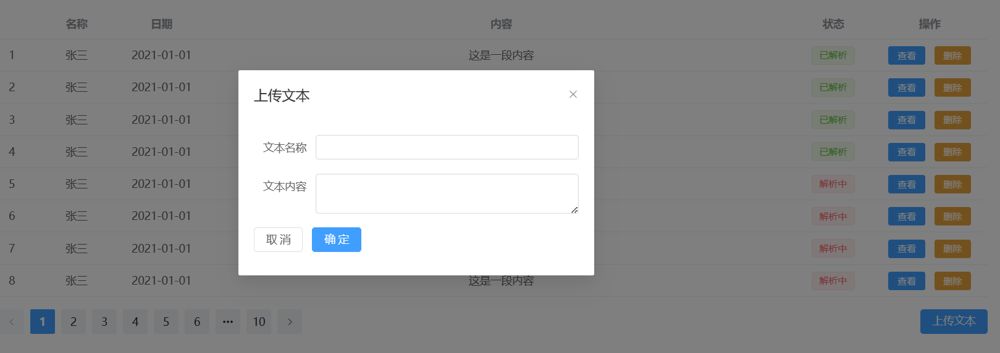

# 思政知识图谱构建项目

## 设计图

### 导航页面


主要功能：

* 图谱查询：输入要查询的内容，以可视化方式展示图谱
* 教案解析：上传教案，解析教案内容，添加思政内容
* 文本解析：输入文本，xxxxxxxxx

### 图谱查询


主要功能：

* 输入查询内容，从思政图谱中查询相关内容
* 根据查询得到的内容，以可视化方式展示图谱

### 教案解析


主要功能：

* 列出已上传教案，显示相关信息和解析状态
* 查看教案解析结果，删除教案
* 上传教案

### 文本解析




主要功能：

* xxxxxxx
* xxxxx
* xxxx

### 查看教案解析结果

todo：

- [ ] 设计图

- [ ] 功能分析

### 查看文本解析结果

ToDo：

- [ ] 设计图

- [ ] 功能分析

### 登录

### 注册

## 接口文档

### 接口名称

请求 URL：`http://127.0.0.1:9999/`

### 通用返回格式

```json
{
    "data": {},
    "code": 0,
    "msg": "操作成功"
}
```

* code为 0 时，代表正常，其他均为异常，异常信息以 msg 为准
* code 为 10400，代表用户未登录
* xxxxxx

### 图谱查询相关接口查询图谱

查询图谱：

* 接口说明：xxxxx

* URL：`/query-kg`

* Method: `POST`

* Request Body: 

  ```json
  {
      "content": "查询内容"
  }
  ```

* Response Body：

  ```json
  {
      "spos": [
          {"s": xxx, "p": xxx, "o": xxx},
          {"s": xxx, "p": xxx, "o": xxx},
          {"s": xxx, "p": xxx, "o": xxx}
      ]
  }
  ```

#### 教案解析接口

获取教案列表：

* URL: `/material-list?userId=xxx`

* Method: `POST`

* Request Body: 

  ```json
  {
      "userID": "xxx"
  }
  ```
  
  
  
  * `userId`: 用户ID，暂时不需要处理，可选
  
* Response Body：

  ```json
  {
      "material": [
          {"id": xxxx, "name": "xxx", "date": "2023-4-7", "description": "xxx", "status": 0},
          {"id": xxxx, "name": "xxx", "date": "2023-4-7", "description": "xxx", "status": 1},
          {"id": xxxx, "name": "xxx", "date": "2023-4-7", "description": "xxx", "status": 2},
      ]
  }
  ```
  
  * `status`: 0 表示解析成功，1 表示正在解析，2 表示解析失败
  

上传教案：

* url: `upload-material`

* Method: `POST`

* Request Body:

    ```json
    {
        "name": "xxx",
        "date": "xxx",
        "description": "xxx",
        "file": File
    }
    ```

* Response Body:
  * code 为 11400 表示文件上传失败

#### 文本解析接口

- [ ] ToDo

#### 查看教案解析结果接口

获取教案具体信息：

* URL: `/get-material`

* Method: `POST`

* Request Body:

  ```json
  {
      "materialID": xxxx
  }
  ```

* Response Body:

  ```json
  {
      "file_conent": file,
      "knowledge_point": [
          {"id": "xxxx", "content": "xxxx"}
      ],
      "jingshen": [{"knowledge_id":, "xxx", "jingshen_id": "xxx", "content": "xxxx"}],
      "case": [{"jingshen_id": "xxx", "case_id": "xxx", "content": "xxx"}]
  }
  ```


查询知识点：

request：

```json
{"file_id": "xxxx"}
```


```json
[
    {"knowledge_point_id": "xxx", "content": "xxxx"}
]
```

查询精神

request: 

```json
{"knowledge_point_id": "xxxx"}
```

response:

```json
[
    {"jingshen_id": "", "content": "xxx"}
]
```

查询 case:

....

保存

request:

```json
{
    "file_conent": file,
    "knowledge_point": [
        {"id": "xxxx", "content": "xxxx"}
    ],
    "jingshen": [{"knowledge_id":, "xxx", "jingshen_id": "xxx", "content": "xxxx"}],
    "case": [{"jingshen_id": "xxx", "case_id": "xxx", "content": "xxx"}]
}
```

response:

```json
{
    "code": 0,
    "mess"
}
```


#### 查看文本解析接口


#### 其他接口
