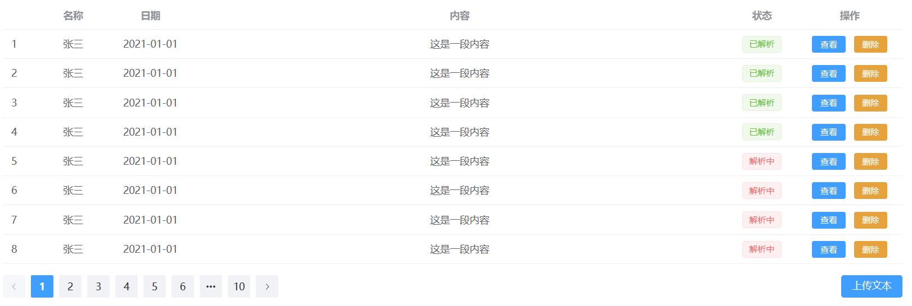

# 思政知识图谱构建项目

## 设计图

### 导航页面


主要功能：

* 图谱查询：输入要查询的内容，以可视化方式展示图谱
* 教案解析：上传教案，解析教案内容，添加思政内容
* 文本解析：输入文本，xxxxxxxxx

### 图谱查询


主要功能：

* 输入查询内容，从思政图谱中查询相关内容
* 根据查询得到的内容，以可视化方式展示图谱

### 教案解析


主要功能：

* 列出已上传教案，显示相关信息和解析状态
* 查看教案解析结果，删除教案
* 上传教案

### 文本解析




主要功能：

* xxxxxxx
* xxxxx
* xxxx

### 查看教案解析结果

todo：

- [ ] 设计图

- [ ] 功能分析

### 查看文本解析结果

ToDo：

- [ ] 设计图

- [ ] 功能分析

### 登录

### 注册

## 接口文档

### 接口名称

请求 URL：`http://127.0.0.1:9999/`

### 通用返回格式

```json
{
    "data": {},
    "code": 0,
    "msg": "操作成功"
}
```

* code为 0 时，代表正常，其他均为异常，异常信息以 msg 为准
* code 为 10400，代表用户未登录
* xxxxxx

### 变量命名解释

* material: 表示教案
* tempor_material: 表示临时教案，简写为tm
* knowledge_point: 表示知识点，简写为kp

### 图谱查询相关接口查询图谱

**查询图谱：**

* 接口说明：xxxxx

* URL：`/query-kg`

* Method: `POST`

* Request Body: 

  ```txt
  {
      "query_content": "查询内容"
  }
  ```

* Response Body：

  ```txt
  {
      "code": xxx,
  	"msg": "xxx",
      "spos": [
          {"s": xxx, "p": xxx, "o": xxx},
          {"s": xxx, "p": xxx, "o": xxx},
          {"s": xxx, "p": xxx, "o": xxx}
      ]
  }
  ```

#### 教案解析接口

**获取教案列表：**

* URL: `/material-list?userId=xxx`

* Method: `POST`

* Request Body: 

  ```txt
  {
      "userID": "xxx"
  }
  ```
  
  
  
  * `userId`: 用户ID，暂时不需要处理，可选
  
* Response Body：

  ```txt
  {
      "material": [
          {"id": xxxx, "name": "xxx", "date": "2023-4-7", "description": "xxx", "status": 0},
          {"id": xxxx, "name": "xxx", "date": "2023-4-7", "description": "xxx", "status": 1},
      ]
  }
  ```
  
  * `status`: 0 表示解析成功，1 表示解析失败
  

**上传教案：**

* URL: `upload-material`

* Method: `POST`

* Request Body:

    ```txt
    {
        "name": "xxx",
        "date": "XXXX-XX-XX",
        "description": "xxx",
        "file": File
    }
    ```

* Response Body:
  
  ```txt
  {
      "code" = xxx
  }
  ```
  
  * code 为 11400 表示文件上传失败

#### 文本解析(临时教案)接口

**获取临时教案列表:**

* URL: `/tm-list?user_id=xxx`

* Method: `POST`

* Request Body
  ``` txt
  {
  	“user_id”: xxx
  } 
  ```

* Response Body
  ```txt
  {
  	"tm": [
  		{"tm_id": xxx, "tm_name": "xxx", "date": "2023-04-07", "description": "xxx"},
  		{"tm_id": xxx, "tm_name": "xxx", "date": "2023-04-07", "description": "xxx"},
  		…
  	]
  }
  ```

  

#### 查看教案解析结果接口

**获取教案具体信息(显示出上传文件的内容; 与默认生成的教案的内容/上一次用户保存的教案的内容)：**

* URL: `/get-material`

* Method: `POST`

* Request Body:

  ```txt
  {
      "materialID": xxx
  }
  ```

* Response Body:

  ```txt
  {
  	"file_id": xxx,  // file_id == material_id ?
  	"file_content": File,
  	"knowledge_point": [
  		{"kp_id": xxx, "kp_content": "xxx"},
  		…
  	],
  	"spirit": [
  		{"kp_id": xxx, "spirit_id": xxx, "spirit_content": "xxx"},
  		…
  	],
  	"case": [
  		{"spirit_id": xxx, "case_id": xxx, "case_content": "xxx"},
  		…
  	]
  }
  ```

**保存生成的教案: **

* URL: `/save-material`
* Method: `POST`
* Request Body:

```txt
{
	"file_id": xxx,  
	"knowledge_point": [
		{"kp_id": xxx, "kp_content": "xxx"},
		…
	],
	"spirit": [
		{"kp_id": xxx, "spirit_id": xxx, "spirit_content": "xxx"},
		…
	],
	"case": [
		{"spirit_id": xxx, "case_id": xxx, "case_content": "xxx"},
		…
	]
}
```

* Response Body:

```txt
{
	"code": 0/1,
	"msg": "保存成功/失败"
}
```

**case替换:**

* URL: /replace-case

* Method: POST

* Request Body
  ``` txt
  {
  	"spirit_id": xxx,
  	"case_id": xxx
  }
  ```

* Response Body
  ```txt
  {
  	"code": 0/1,
  	"case_id": xxx,
  	"case_content": "xxx"
  }
  ```

  

#### 查看文本解析接口

**获取临时教案具体信息(可能是空白/也可能是用户上一次保存的临时教案的内容)：**

* URL: `/get-tm`

* Method: `POST`

* Request Body:

  ```txt
  {
      "tm_ID": xxx
  }
  ```

* Response Body:

  ```txt
  {
  	"tm_id": xxx, 
  	"knowledge_point": [
  		{"kp_id": xxx, "kp_content": "xxx"},
  		…
  	],
  	"spirit": [
  		{"kp_id": xxx, "spirit_id": xxx, "spirit_content": "xxx"},
  		…
  	],
  	"case": [
  		{"spirit_id": xxx, "case_id": xxx, "case_content": "xxx"},
  		…
  	]
  }
  ```

**用户输入知识点并点击“确认输入”后，生成对应的精神、case:**

* URL: /generate-spirit&case

* Method: POST

* Request Body
  ```txt
  {
  	"kp_content" = "xxx",    //用户输入的字符串
  	"kp_id" = xxx  //前端为该知识点生成一个id
  }
  ```

* Response Body

  ```txt
  {
  	"code": 0/1,
  	"spirit": [
  		{"spirit_id": xxx, "spirit_content": "xxx"},
  		…
  	],
  	"case": [
  		{"spirit_id": xxx, "case_id": xxx, "case_content": "xxx"},
  		…
  	]
  }
  ```

**查询知识点:**

* URL: `/query-kp`

* Method: `POST`

* Request Body
  ```txt
  {
  	"tm_id": xxx
  }
  ```

* Response Body
  ```txt
  {
  	[
  		{"kp_id": xxx, "kp_content": "xxx"},
  		…
  	]
  }
  ```

**查询精神:**

* URL: `/query-spirit`

* Method: `POST`

* Request Body
  ```txt
  {
  	"kp_id": xxx
  }
  ```

* Response Body
  ```txt
  {
  	[
  		{"spirit_id": xxx, "spirit_content": "xxx"},
  		…
  	]
  }
  ```

**查询case:**

* URL: `/query-case`

* Method: `POST`

* Request Body
  ```txt
  {
  	"spirit_id": xxx
  }
  ```

* Response Body
  ```txt
  {
  	[
  		{"case_id": xxx, "case_content": "xxx"},
  		…
  	]
  }
  ```

**case替换：**

	同教案解析

**保存临时教案：**

* URL: `/save-tm`
* Method: `POST`
* Request Body:

```txt
{
    "tm_id": xxx,  
    "tm_name": "xxx",
    "tm_description": "xxx",
    //date可以由后端直接生成
	"knowledge_point": [
		{"kp_id": xxx, "kp_content": "xxx"},
		…
	],
	"spirit": [
		{"kp_id": xxx, "spirit_id": xxx, "spirit_content": "xxx"},
		…
	],
	"case": [
		{"spirit_id": xxx, "case_id": xxx, "case_content": "xxx"},
		…
	]
}
```

* Response Body:

```txt
{
	"code": 0/1,
	"msg": "保存成功/失败"
}
```


#### 其他接口
